<h1 align="center">Sphlash</h1>

 

## Deployed Link
https://sphlash.web.app/

## Demo video

link: https://youtu.be/AN0Fa8dgixs

## Problem Statement

The issue of unavailability of micro loans for student has troubled many students for a long time. Along with the slow and complex process of acquiring bigger student loans, students are often found wanting for a faster and better method of acquiring micros and macro loans.

The need of the hour is to <b>create an application for simplifying and automating the process of acquiring micro and macro loans for students and get more options for choosing the loans of their choice.</b>

## Our Solution

Sphlash is a online banking system exclusively for students for the purpose of acquiring micro loans and easy student loans based on their academic collateral. The application is built for both the bank/lender and the student side as a single dynamic app for easier access.

The student can enter into the app and can upload his/her academic credentials along with other details. The app generates a score based on the performance of the students on academic, non – curricular activities and other accolades won by the student. This score is then used for searching loans most appropriate for the students based on his academic collateral.

Similarly for the lender/bank , the application provide them a platform for easier usage and more footfalls for them. They can upload their loans as per their type and usage.

The application also provides both the student and lender side with transaction history and option to edit their credentials for better maintenance of their profiles. Also , there is an admin side for profile verification of both lender and user side for fraud detection and management of transactions, creating a three tier architecture for the application.

## Impact

 The application is exclusively built for students , who are also its largest user base , with the prospect generating of easier and faster loans. Also the students can choose from a myriad of loan options from multiple lenders at the same time and can choose the loan as per his suitability.

This application will also have a profound impact on recognized lenders and banks , which can use the application for gathering a larger footfall, reducing the clutter of many different process by streamlining of the application for a single purpose, gathering of collaterals and management of transactions within a single application.

## Techonolgy Stack
1. Frontend – ReactJS.
2. Backend – Firebase.
3. Database – Firestore.
4. Visual customization – Material UI.
5. Authentication – Google Login / SAWO API.
6. Mock-ups and Flowcharts – MS Paint and Creately.
7. Payment – Stripe / PayPal / Google Pay.

## Future Prospects

1. The application is to be fully turned as a MERN stack application for better usage and more utilities.
2. The application can be further containerized to ease the creation, deploy and the delivery of an application using containers, allowing the developer/sysadmin to bundle an application with all needed components (libraries and other resources) and to deliver it as an independent and single package.
3. The app will be made multi-lingual for accessibility of more users.
4. Mobile application to be coming soon.

## Innovation
1. The application is exclusively built for students , hence reducing the clutter of different types of loans and processes.
2. The app has three tier architecture for additional security and logging of transactions, maintaining the CIA triad for security and reducing chances of fraud.
3. Students can sort through the loans as per their requirement and usage , as well as lenders/banks can get a solid collateral without the hassle of additional processes within a single application.
4. The scoring matrix used for macro loans makes the process of giving and taking loans for both the lender and student easier by streamlining the process.

## Feasibility

1. The application is highly feasible due to it being a web-app and based on the MERN stack platform , meaning that can be easily shifted to a newer technology and go through changes and revisions without much technical clutter. The application can be further containerized and used as a package , removing manual reconfiguration work and significantly reduce interoperability concerns.

2. The application also remains a viable solution for future changing banking and social scenario, where the need of faster and more efficient solutions are required. 

## Designs & Mock-ups
## Admin Dashboard

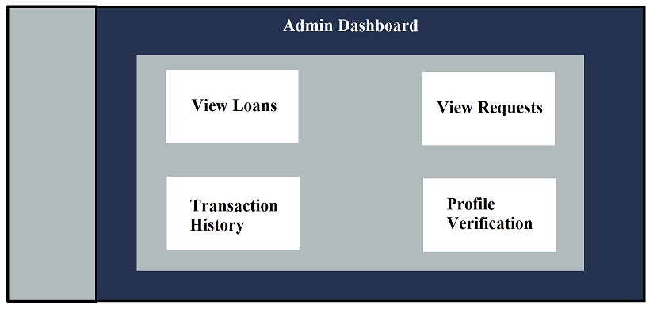

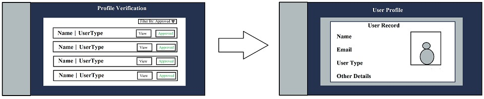

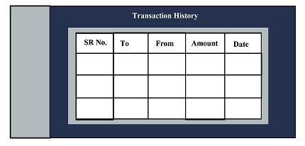

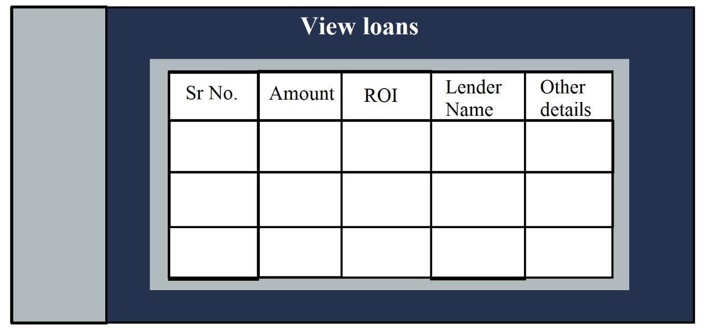

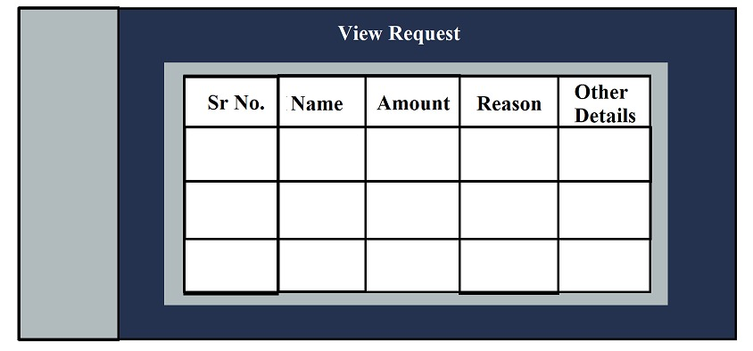

## Lender Dashboard

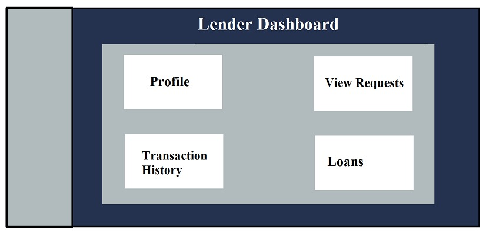

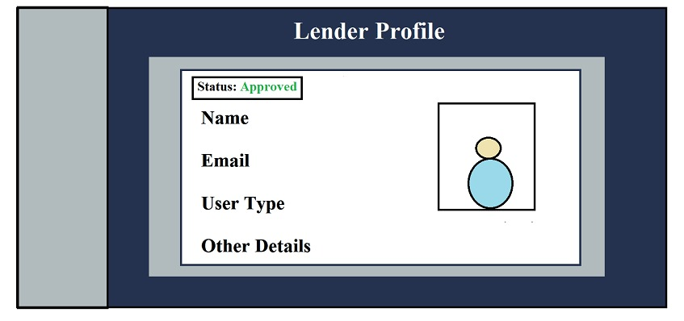

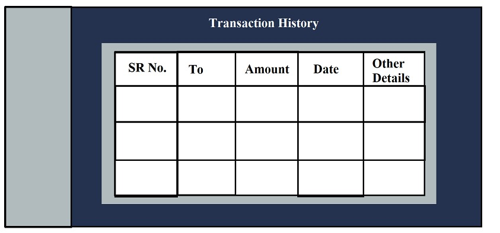

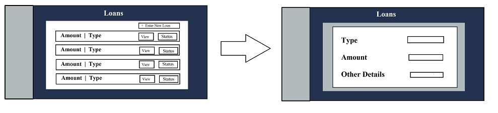

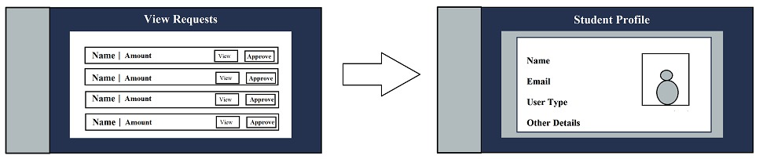

## Flowcharts

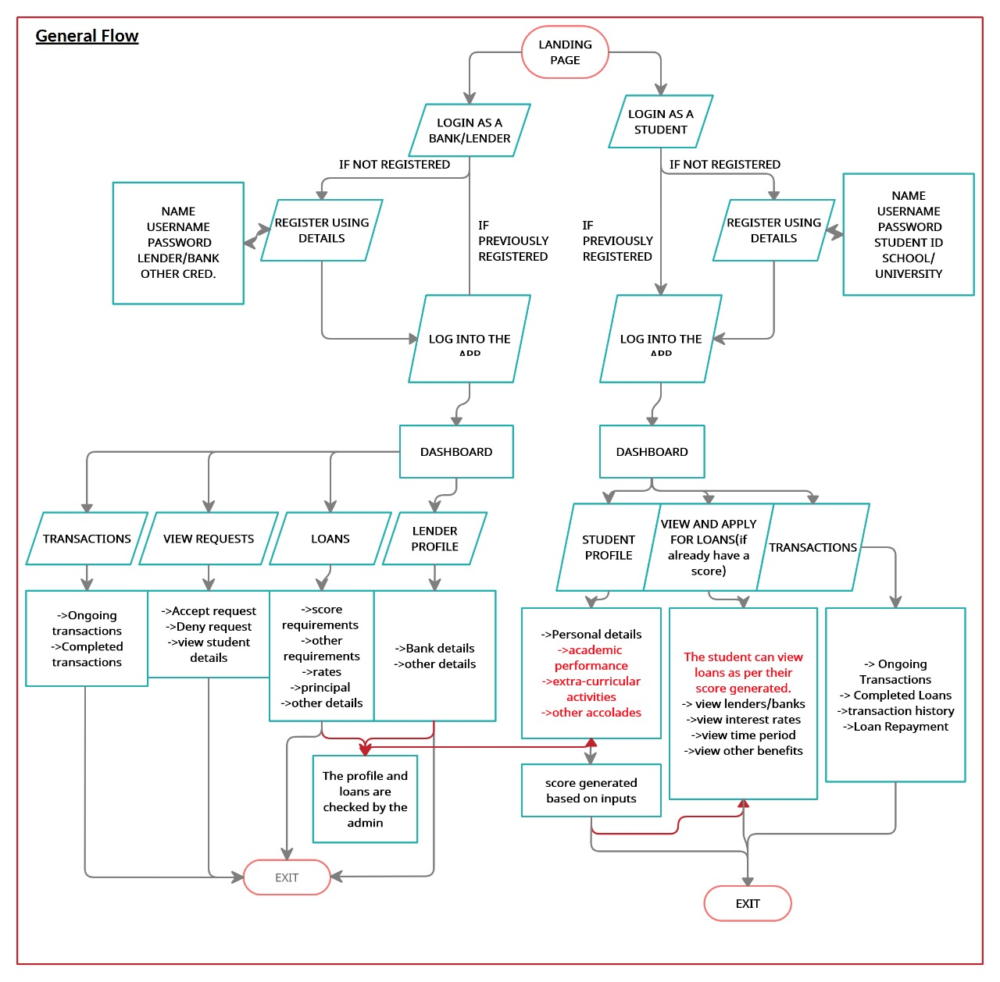

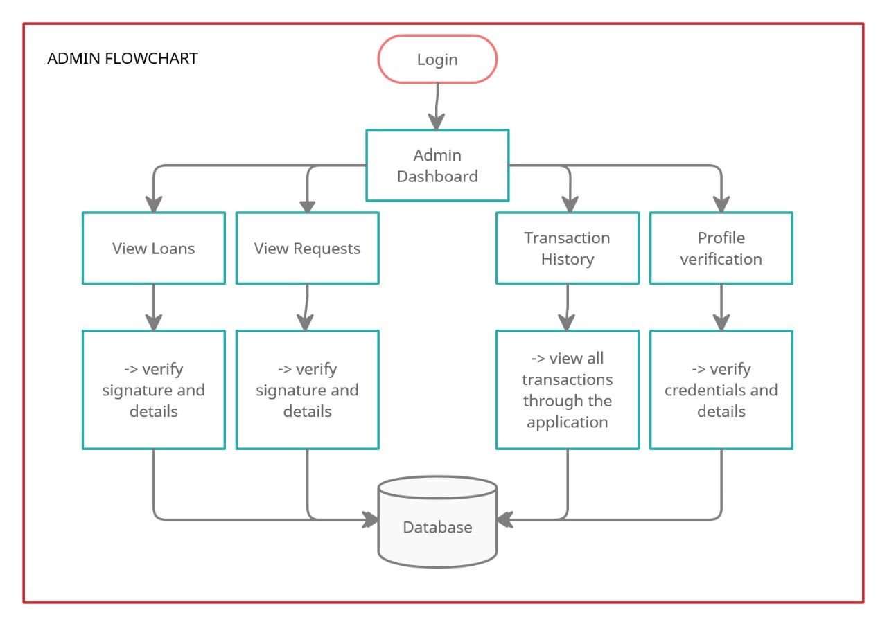

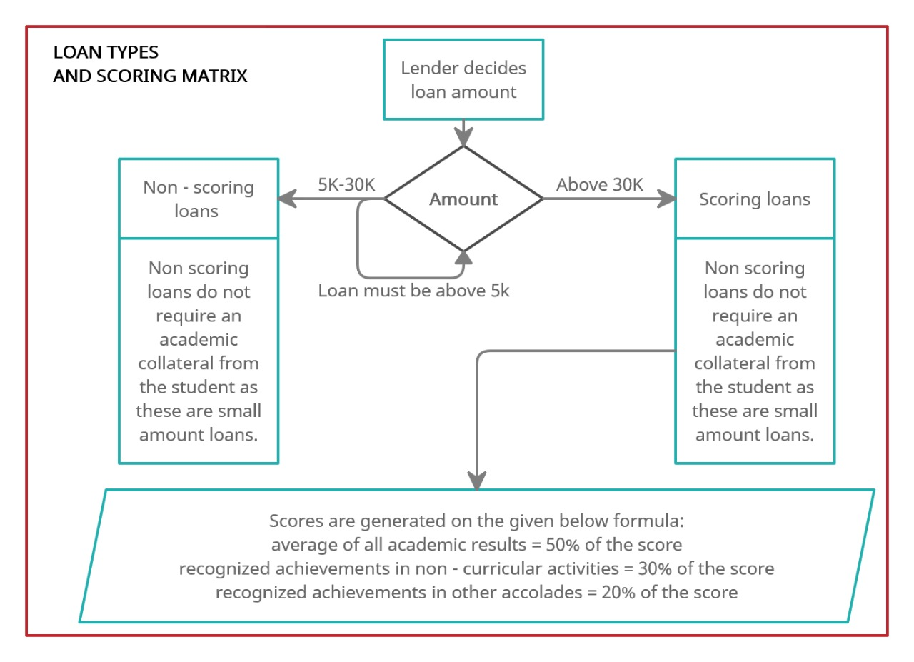

## Working

## Team members

1. Pranjal Srivastava - [LinkedIn](https://www.linkedin.com/in/pranjal-srivastava-801a9a152/) [GitHub](https://github.com/pranjals149)
2. Ramankur Goswami - [LinkedIn](https://www.linkedin.com/in/ramankurgoswami/) [GitHub](https://github.com/RamankurGoswami)
3. Shivam Purohit - [LinkedIn](https://www.linkedin.com/in/shivam-purohit-0930381aa/) [GitHub](https://github.com/ShivamPurohit)
